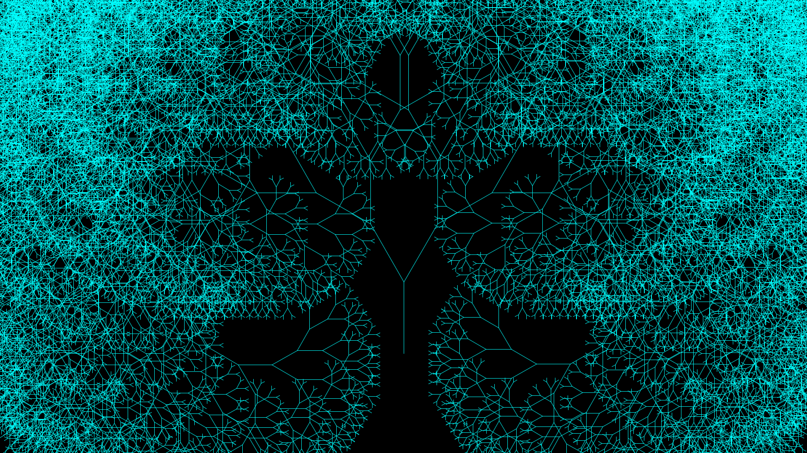
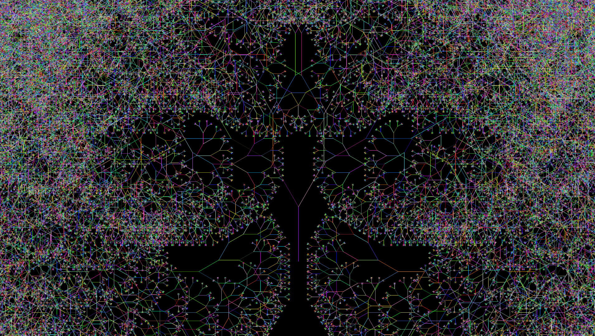

# Rust Fractal Trees

    
    

A simple program that allows the user to draw beautiful fractal trees.

# Contribution 

If you'd like to contribute to `rust_fractal_trees` please submit a pull-request on a feature branch.

# Installing

Clone the repo:

    git clone https://github.com/Sommos/rust_fractal_trees

    cd rust_fractal_trees